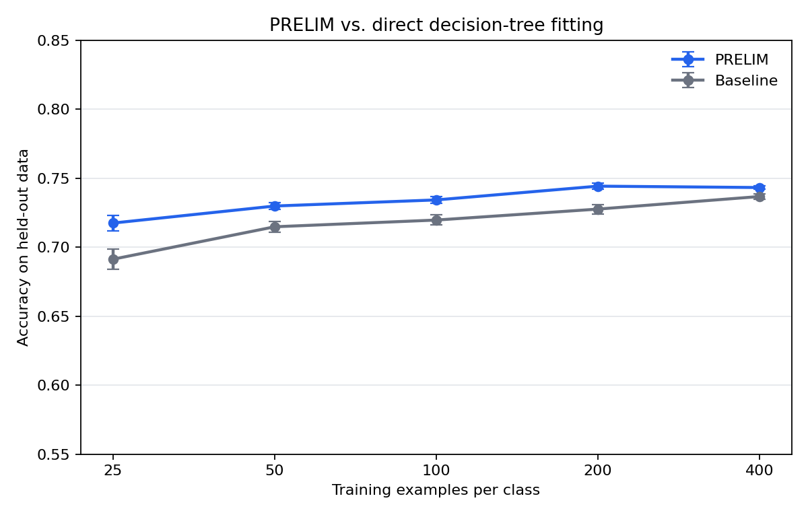

## PRELIM &mdash; **P**edagogical **R**ule **E**xtraction to **L**earn **I**nterpretable **M**odels

`prelim` is the python module that allows one to learn better comprehensible rule-based models (e.g., decision trees, classification rules, subgroups) from small datasets. Besides the distribution of `prelim`, this folder also contains the subdirectory `experiments` with the code to reproduce the experiments from the manuscript.

### Installation

This repository contains two pieces:

- `prelim`: the installable Python package under `src/prelim`.
- `experiments/`: repo-local manuscript reproduction code with additional dependencies.

For local development with the `prelim` package, create a virtual environment and install `prelim` in editable mode.

With [uv](https://docs.astral.sh/uv/):
```
uv venv
source .venv/bin/activate
uv pip install -e .
```

With the standard library [venv](https://packaging.python.org/en/latest/guides/installing-using-pip-and-virtual-environments/):
```
python -m venv .venv
source .venv/bin/activate
python -m pip install -e .
```

To install directly from GitHub instead of a local checkout:
```
python -m pip install git+https://github.com/Arzik1987/prelim
```

The package currently keeps older dependency pins in `setup.cfg`; if you use a newer Python stack, run the tests after installing.

To run the manuscript reproduction code, install the package first and then install the experiment-only requirements:
```
uv pip install -e .
uv pip install -r experiments/requirements.txt
```

Then run experiment entry points from the repository root:
```
PYTHONPATH=src python experiments/experiments.py
PYTHONPATH=src python experiments/read_results.py
```

### Testing the package contents
Call `pytest` from the project root after installing the package locally:
```
pytest
```

For source-level checks without installing, many tests can also be run with:
```
PYTHONPATH=src pytest
```

To remove generated local artifacts such as `__pycache__`, `.pytest_cache`, build directories, and egg-info metadata, run:
```
python scripts/clean_artifacts.py
```

### Basic Usage

`prelim` trains an interpretable white-box model through a stronger mediator model:

1. Fit or reuse a mediator model on the small training set.
2. Generate extra feature rows with a transfer-set generator such as `kde`.
3. Label those generated rows with the mediator.
4. Fit the target interpretable model on the generated data plus the original data.

In the example below, the mediator is a random forest and the interpretable target model is a small decision tree.

```python
import numpy as np
from sklearn.tree import DecisionTreeClassifier
from sklearn.ensemble import RandomForestClassifier
from prelim.prelim import prelim

# Generate synthetic dataset
n_samples = 50
covariance_matrix = [[1, 0], [0, 1]]

X_class0 = np.random.multivariate_normal([0, 0], covariance_matrix, n_samples)
X_class1 = np.random.multivariate_normal([1, 1], covariance_matrix, n_samples)
X = np.vstack((X_class0, X_class1))
y = np.hstack((np.zeros(n_samples), np.ones(n_samples))).astype(int)

# Define models
mediator = RandomForestClassifier()
rule_based_model = DecisionTreeClassifier(max_leaf_nodes=8)

# Train using Prelim
wb_model = prelim(
    X,
    y,
    mediator,
    rule_based_model,
    gen_name='kde',
    new_size=2000,
    proba=False,
    verbose=True
) 
```

### Small Reproducible Demonstration

The script below compares PRELIM against the same decision-tree model fitted directly on the small training data. It repeats a synthetic two-class problem across several sample sizes, saves the plot, and writes the summary numbers used here.

```bash
PYTHONPATH=src python examples/readme_small_experiment.py
```



The plot shows mean test accuracy over 20 seeded repetitions. Error bars are standard errors. In this setting, PRELIM improves the decision tree most when the training set is smallest, because the tree is fitted on a mediator-labeled transfer set instead of only the original small sample.

Summary from the generated run:

| Training examples per class | PRELIM mean accuracy | Baseline mean accuracy | Mean improvement |
| ---: | ---: | ---: | ---: |
| 25 | 0.718 | 0.691 | +0.026 |
| 50 | 0.730 | 0.715 | +0.015 |
| 100 | 0.734 | 0.720 | +0.015 |
| 200 | 0.744 | 0.728 | +0.017 |
| 400 | 0.743 | 0.737 | +0.007 |

Across all runs, PRELIM averaged `0.734` accuracy versus `0.718` for the direct decision-tree baseline, an average improvement of `+0.016`.

### Reproducing the Experiments
See respective description in the subdirectory `experiments`.
